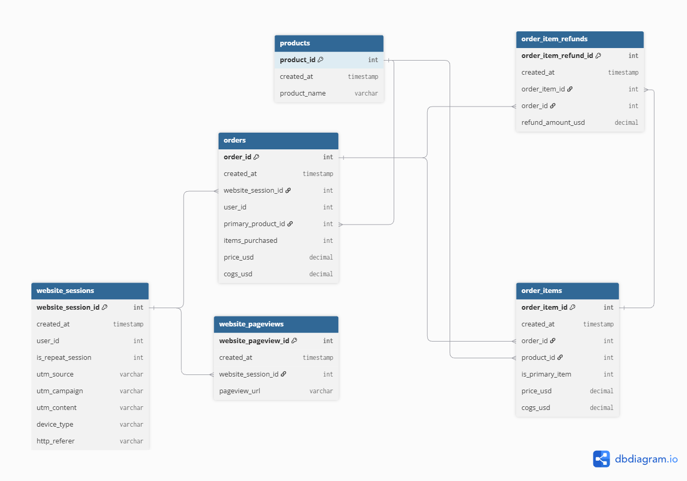
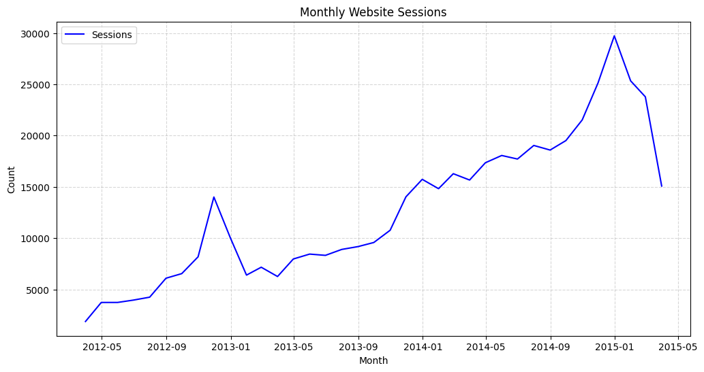
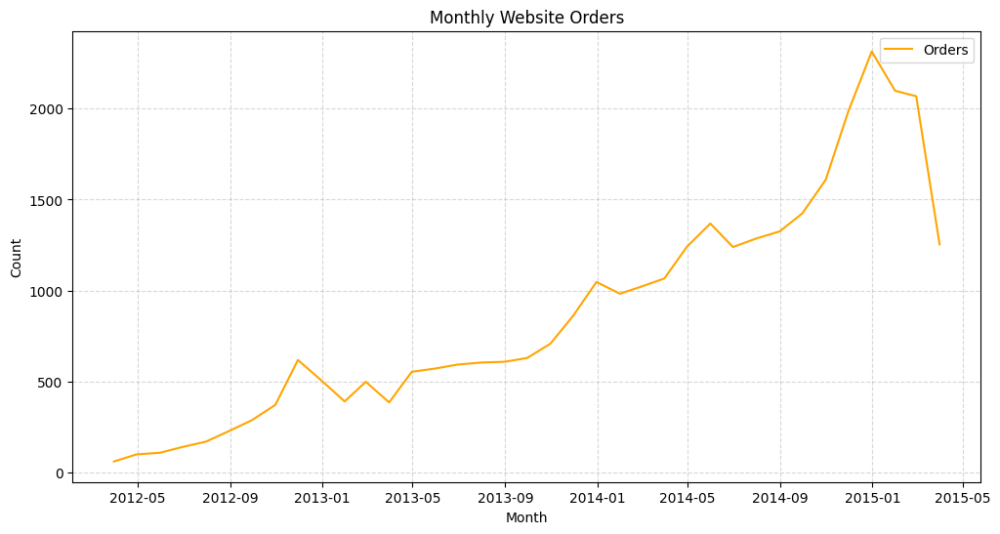
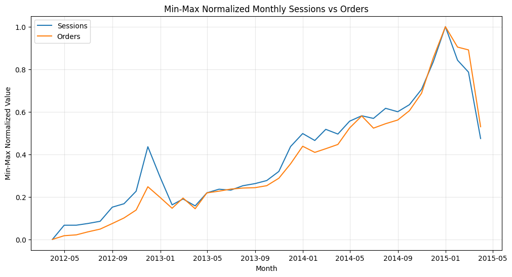
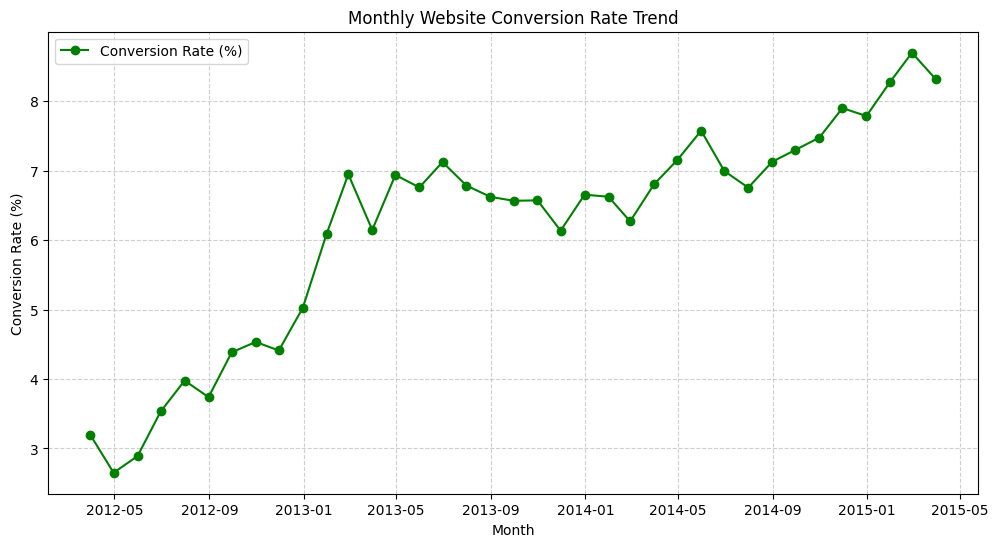
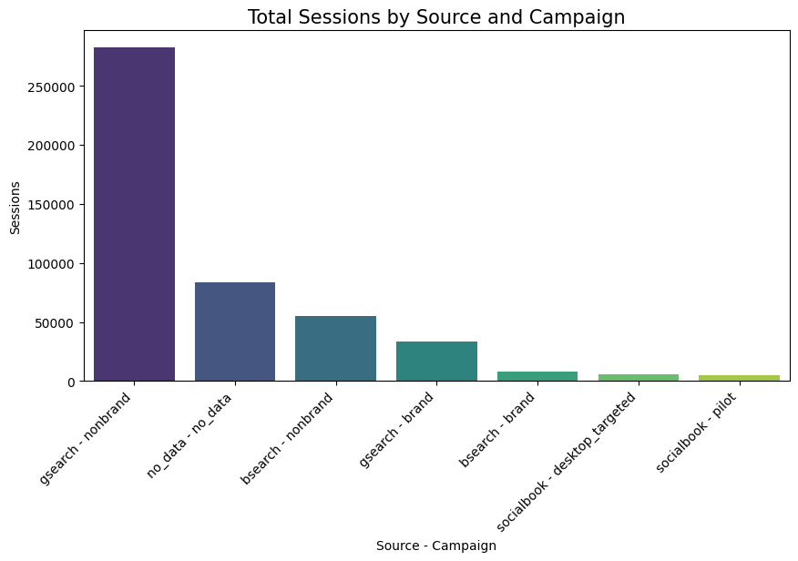
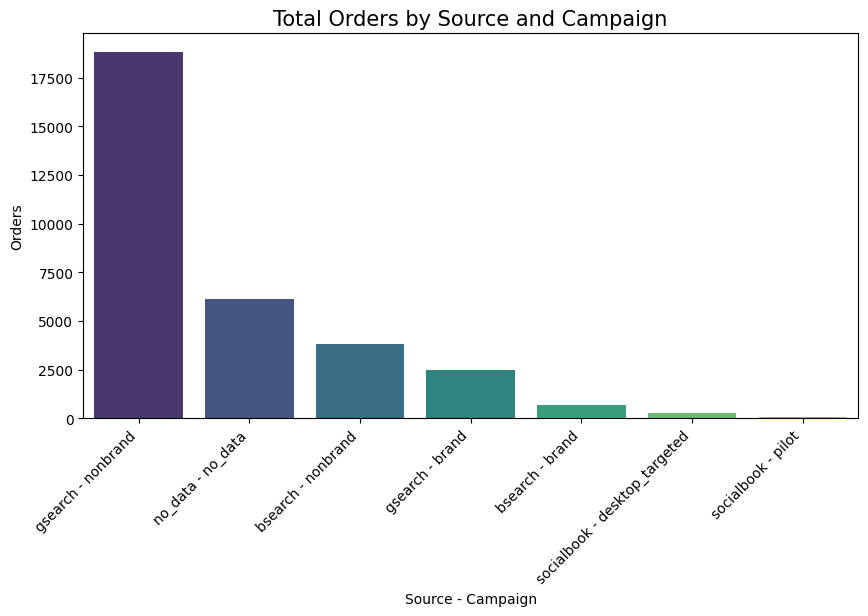
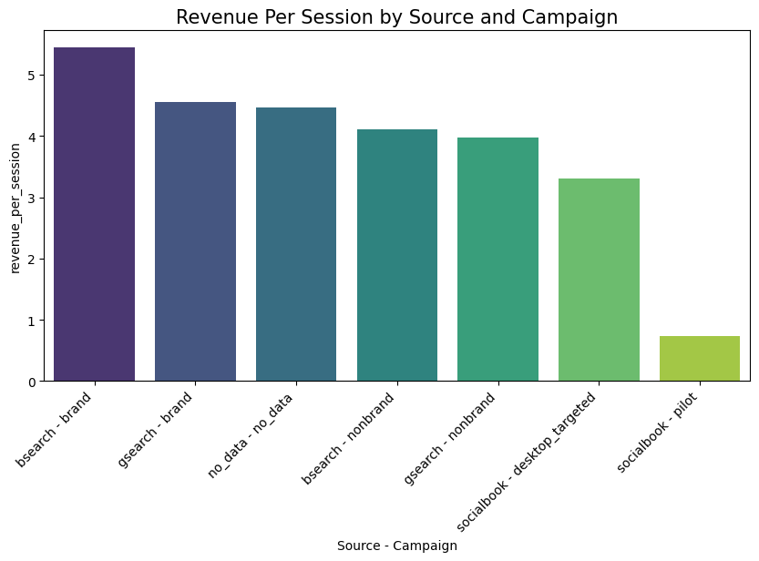
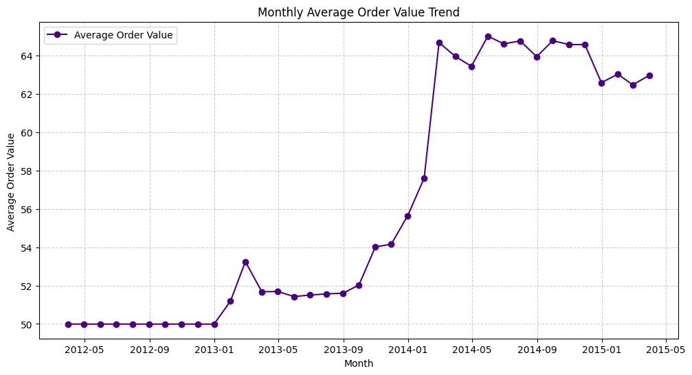
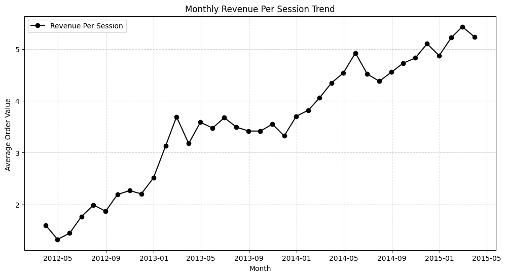

# Analisis Data Toy Store E-Commerce (Maven Analytics) 🧸

## 📌 Daftar Isi

- [📌 Deskripsi Proyek](#-deskripsi-proyek)
- [🎯 Pertanyaan Bisnis](#-pertanyaan-bisnis)
  - [Pertanyaan 1](#pertanyaan-1)
  - [Pertanyaan 2](#pertanyaan-2)
  - [Pertanyaan 3](#pertanyaan-3)
  - [Pertanyaan 4](#pertanyaan-4)
- [📊 Dataset](#-dataset)
- [📝 Kesimpulan](#-kesimpulan)
  - [Pertanyaan 1](#pertanyaan-1-1)
  - [Pertanyaan 2](#pertanyaan-2-2)
  - [Pertanyaan 3](#pertanyaan-3-3)
  - [Pertanyaan 4](#pertanyaan-4-4)
- [🪜 Rekomendasi Action Item](#-rekomendasi-action-item)       

## 📌 Deskripsi Proyek

Proyek ini merupakan analisis data terhadap **Toy Store E-Commerce**, yaitu dataset yang mencakup informasi mengenai kunjungan website (website sessions), rincian transaksi pesanan (orders dan order items), data produk, hingga pengembalian dana (order item refunds).

Analisis dilakukan untuk memahami performa kunjungan website, tingkat konversi (conversion rate), efektivitas saluran pemasaran (marketing channels), serta tren pendapatan bisnis, nilai rata-rata pesanan (AOV), dan pendapatan per sesi (RPS).

Hasil analisis kemudian divisualisasikan ke dalam bentuk grafik analitis sebagai insight strategis terkait pertumbuhan bisnis, perilaku konsumen, dan efektivitas strategi pemasaran toko mainan tersebut.

---

## 🎯 Pertanyaan Bisnis

Analisis ini dilakukan untuk menjawab beberapa pertanyaan bisnis berikut:

### Pertanyaan 1

Bagaimana tren jumlah kunjungan/sesi di website dan volume pesanan?

### Pertanyaan 2

Berapa tingkat konversi dari kunjungan website menjadi pesanan? Bagaimana trennya dari waktu ke waktu?

### Pertanyaan 3

Saluran pemasaran (marketing channel) mana yang paling berhasil/efektif?

### Pertanyaan 4

Bagaimana perkembangan pendapatan rata-rata per pesanan? Bagaimana dengan pendapatan rata-rata per kunjungan/sesi website?

---

## 📊 Dataset

Dataset yang digunakan adalah **Toy Store E-Commerce Database** yang berasal dari Maven Analytics.

Diunduh dari [Maven Analytics - Toy Store E-Commerce Database](https://mavenanalytics.io/data-playground/toy-store-e-commerce-database)

Dataset terdiri dari 7 file:

- `maven_fuzzy_factory_data_dictionary.csv` — Berisi dictionary Setiap Kolom di Dataset
- `orders.csv` — Berisi ringkasan total dari sebuah transaksi/pembelian yang berhasil.
- `order_items.csv` — Berisi riwayat transaksi/pembelian yang berhasil per order item.
- `order_item_refunds.csv` — Berisi riwayat barang spesifik yang dikembalikan oleh pelanggan (refund).
- `products.csv` — Berisi katalog atau master data barang yang dijual oleh toko.
- `website_pageviews.csv` — Berisi riwayat halaman spesifik apa saja yang diklik/dilihat oleh pelanggan selama satu sesi kunjungan tersebut.
- `website_sessions.csv` Berisi riwayat tentang suatu pengguna (secara anonim) ketika setiap kali mengunjungi website (satu kunjungan = satu sesi)

### Variabel Dataset

Untuk Relasi Antar Tabel anda dapat melihat pada [link ini](https://dbdiagram.io/d/Relasi-Antar-Tabel-6a9a9f0750ad2c46dc3edf48)

#### 1. Tabel `orders`

| Kolom                | Deskripsi                                                                             |
| :------------------- | :------------------------------------------------------------------------------------ |
| `order_id`           | Pengenal unik untuk setiap pesanan (PK)                                               |
| `created_at`         | Waktu saat pesanan dibuat                                                             |
| `website_session_id` | Pengenal unik untuk sesi website (FK)                                                 |
| `user_id`            | Pengenal unik untuk pengguna (FK)                                                     |
| `primary_product_id` | Pengenal unik untuk produk utama dalam pesanan jika merupakan bagian dari bundel (FK) |
| `items_purchased`    | Jumlah item dalam pesanan                                                             |
| `price_usd`          | Total harga untuk item-item dalam pesanan                                             |
| `cogs_usd`           | Harga pokok penjualan (COGS) untuk item-item dalam pesanan                            |

#### 2. Tabel `order_items`

| Kolom             | Deskripsi                                                           |
| :---------------- | :------------------------------------------------------------------ |
| `order_item_id`   | Pengenal unik untuk setiap item pesanan (PK)                        |
| `created_at`      | Waktu saat pesanan dibuat                                           |
| `order_id`        | Pengenal unik untuk pesanan tempat item tersebut berada (FK)        |
| `product_id`      | Pengenal unik untuk produk (FK)                                     |
| `is_primary_item` | Label biner dengan nilai 1 jika itu adalah item utama dalam pesanan |
| `price_usd`       | Harga produk                                                        |
| `cogs_usd`        | Harga pokok penjualan (COGS) produk                                 |

#### 3. Tabel `order_item_refunds`

| Kolom                  | Deskripsi                                                                      |
| :--------------------- | :----------------------------------------------------------------------------- |
| `order_item_refund_id` | Pengenal unik untuk setiap pengembalian dana/refund (PK)                       |
| `created_at`           | Waktu saat pengembalian dana dikeluarkan                                       |
| `order_item_id`        | Pengenal unik untuk item pesanan yang dikembalikan dananya (FK)                |
| `order_id`             | Pengenal unik untuk pesanan tempat item yang dikembalikan dananya berasal (FK) |
| `refund_amount_usd`    | Jumlah pengembalian dana                                                       |

#### 4. Tabel `products`

| Kolom          | Deskripsi                       |
| :------------- | :------------------------------ |
| `product_id`   | Pengenal unik untuk produk (PK) |
| `created_at`   | Waktu saat produk diluncurkan   |
| `product_name` | Nama produk                     |

#### 5. Tabel `website_sessions`

| Kolom                | Deskripsi                                                                |
| :------------------- | :----------------------------------------------------------------------- |
| `website_session_id` | Pengenal unik untuk sesi website (PK)                                    |
| `created_at`         | Waktu saat sesi dimulai                                                  |
| `user_id`            | Pengenal unik untuk pengguna (FK)                                        |
| `is_repeat_session`  | Label biner dengan nilai 1 jika pengguna pernah memiliki sesi sebelumnya |
| `utm_source`         | Parameter sumber UTM (asal traffic)                                      |
| `utm_campaign`       | Parameter kampanye UTM (nama kampanye pemasaran)                         |
| `utm_content`        | Parameter konten UTM (varian iklan/konten)                               |
| `device_type`        | Kategori perangkat (seluler/mobile atau desktop)                         |
| `http_referer`       | URL untuk sumber UTM                                                     |

#### 6. Tabel `website_pageviews`

| Kolom                 | Deskripsi                                                                       |
| :-------------------- | :------------------------------------------------------------------------------ |
| `website_pageview_id` | Pengenal unik untuk setiap penayangan halaman (pageview) website (PK)           |
| `created_at`          | Waktu untuk penayangan halaman                                                  |
| `website_session_id`  | Pengenal unik untuk sesi website tempat penayangan halaman tersebut berada (FK) |
| `pageview_url`        | Jalur URL untuk penayangan halaman                                              |

## 📝 Kesimpulan

## Pertanyaan 1

Pertumbuhan kunjungan website dan volume pembelian pada perusahaan Maven Fuzzy Factory menunjukkan tren peningkatan yang konsisten dari Mei 2012 hingga awal tahun 2015, yang mengindikasikan bahwa Toko Mainan sedang berada dalam fase growth. Hal tersebut semakin diperkuat oleh grafik Min-Max Normalized untuk kedua kolom yang menunjukkan pola jumlah sesi dan jumlah pesanan berhimpitan hampir sempurna, yang menandakan pertumbuhan trafik website berbanding lurus secara linier dengan pertumbuhan penjualan perusahaan.

### Pertanyaan 2

Rata-rata tingkat konversi dari kunjungan website menjadi pesanan pada perusahaan Maven Fuzzy Factory adalah sebesar 6.18%, dengan capaian terendah pada bulan April 2012 sebesar 2.65% dan tertinggi pada bulan Februari 2015 sebesar 8.69%. Dari segi tren, tingkat konversi yang sebelumnya tergolong rendah di kisaran 2%-4% pada pertengahan hingga akhir tahun 2012 mengalami lonjakan tajam hingga menembus angka 6%-7% pada tahun 2013, sebelum akhirnya bergerak jauh lebih stabil, matang, dan konsisten hingga awal tahun 2015.

### Pertanyaan 3

Kombinasi saluran pemasaran `utm_source` gsearch dan `utm_campaign` nonbrand pada perusahaan Maven Fuzzy Factory terbukti paling efektif sebagai roda penggerak utama volume penjualan serta penarik traffic awal website karena mendominasi perolehan total pesanan dan kunjungan website secara masif.

Namun, dari sisi kualitas dan efisiensi moneter, saluran berbasis pencarian merek (`utm_campaign` brand) seperti pada `utm_source` bsearch dan gsearch menunjukkan performa terbaik karena mencatatkan tingkat konversi (Conversion Rate) serta pendapatan per sesi (Revenue Per Session) tertinggi. Hal ini mengindikasikan bahwa pengguna yang mencari merek secara langsung di internet jauh lebih besar kemungkinannya untuk bertransaksi dengan nominal rata-rata yang lebih tinggi dibandingkan pencarian kata kunci generik.

### Pertanyaan 4

Perkembangan pendapatan rata-rata per pesanan (Average Order Value/AOV) pada perusahan Maven Fuzzy Factory tercatat konstan di angka 50 USD dari Mei 2012 hingga Januari 2013, sempat mengalami sedikit kenaikan sebelum stabil kembali di kisaran 50-51 USD, lalu melonjak signifikan mulai Oktober 2013 hingga mencapai 65 USD pada Maret 2014 sebelum akhirnya mengalami stagnasi di kisaran 62 hingga 65 USD hingga akhir periode dengan sedikit penurunan di awal tahun 2015. Sementara itu, perkembangan pendapatan rata-rata per kunjungan atau sesi website (Revenue Per Session/RPS) menunjukkan grafik uptrend yang sangat konsisten dari waktu ke waktu, di mana nilainya melonjak naik dari sekitar 1.5 USD pada awal tahun 2012 hingga melampaui 5 USD pada tahun 2015.

## 🪜 Rekomendasi Action Item

Berdasarkan seluruh hasil analisis, beberapa rekomendasi yang dapat diberikan adalah:

- Pertahankan dan optimalkan alokasi anggaran marketing pada saluran `utm_source` gsearch dengan `utm_campaign` nonbrand karena terbukti menjadi motor penggerak utama dalam mendatangkan trafik kunjungan masif serta volume pesanan terbesar.

- Dapat meningkatkan branding awareness pada seluruh platform untuk memanfaatkan tingginya tingkat konversi (CVR) dan pendapatan per sesi (RPS) dari kelompok high-intent buyers.

- Mempersiapkan infrastruktur website e-commerce, stok inventaris, logistik barang, dan layanan operasional sebelum memasuki Kuartal 4 (Q4) untuk mengantisipasi lonjakan musiman liburan dan perayaan Natal secara optimal.

- Evaluasi faktor pendorong di balik kenaikan nilai AOV yang sempat menyentuh angka 65 USD agar strategi upselling atau penawaran produk bernilai tinggi tersebut dapat distabilkan dan ditingkatkan kembali.